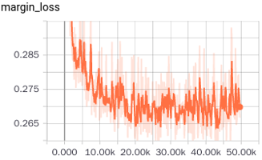
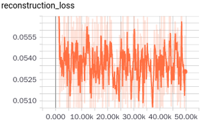

# capsule_networks

## Overview

This code is implemented based on the Dynamic Routing between Capsules paper by Hinton et.al.


## Requirements
- Python
- NumPy
-Tensorflow
- tqdm (for showing training progress info)

## Steps

**Step 1.** 
Clone and cd into the dir.


**Step 2.** 
Download [MNIST dataset](http://yann.lecun.com/exdb/mnist/)


**Step 3.** 
```
$ python train.py
```


### Evaluation
```
$ python eval.py --is_training False
```


## Results


- training loss





- accuracy
------------

|:----:|:----:|:--:|
|test acc|94.68|94.95|


